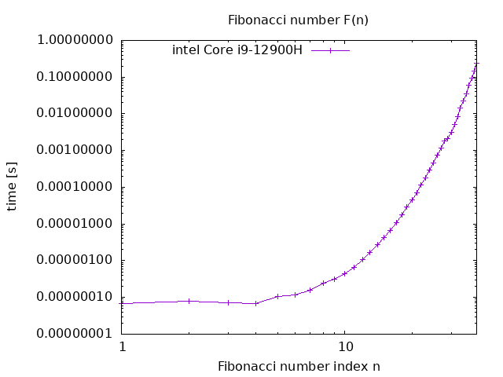

<!--

This document is written in Markdown.
You can preview on such as VisualStudio Code.
If you want to know more, search with "vscode markdown" or refer to official document https://code.visualstudio.com/Docs/languages/markdown .

-->

# 1. フィボナッチ数列

$$
\begin{align*}
	F_{0}=0,F_{1}=1\\
	F_{n+2}=F_{n+1}+F_{n}
\end{align*}
$$
## Cコード
### フォルダ構成
- bin：実行ファイル(.out)を置くフォルダ
- build：コンパイル時の作成ファイルを置くフォルダ
	- dep：コンパイル時の依存関係ファイル(.d)を置くフォルダ
	- obj：コンパイル時のオブジェクトファイル(.o)を置くフォルダ
- docs：ドキュメントファイルを置くフォルダ
	- image：ドキュメントファイルに挿入する図を置くフォルダ
- include：ヘッダーファイル(.h)を置くフォルダ
- lib：プロジェクトに使用するライブラリファイル(.a)を置くフォルダ
- parts：プロジェクトに使用するライブラリファイルのソースコードを置くフォルダ
- src：ソースファイル(.c)を置くフォルダ
- test：ライブラリテストコードファイル(.c)を置くフォルダ

LICENCE：  
makefile：  
Plot.sh：  
README.md：  

### フィボナッチ数出力関数
再帰関数を使う。
```C
/*standard library*/
#include <stdint.h>

/*
*	function name:Fibonacci
*	about:
*		calculate Fibonacci number
*
*	caution:
*		define Fibonacci(0)=0,Fibonacci(1)=1.
*
*	in	int64_t		n		:Fibonacci number index
*	out	int64_t				:calculate answer
*/
uint64_t Fibonacci(uint64_t n)
{
	if(n == 0)
	{
		return 0;
	}
	else if(n == 1)
	{
		return 1;
	}

	return Fibonacci(n - 1) + Fibonacci(n - 2);
}
```

### 時間計測処理
C言語標準ライブラリ<time.h>内関数clock_gettime()を使う。  
この関数の引数の一つ、クロックIDにはCLOCK_REALTIMEを指定しているがどれがいいのかは正直わからない。
```C
/*standard library*/
#include <stdio.h>
#include <stdint.h>
#include <time.h>

/*
*	function name:main
*	about:
*		project main function
*
*	in	uint64_t	argc	:command line argument number
*	in	char*		argv[]	:command line argument pointer
*	out	int					:error code
*/
int main(uint64_t argc, char const* argv[])
{
	clock_t start_clock, end_clock;
	uint64_t n_1 = 40, ans = 0;
	double runTime[n_1];
	struct timespec startTime, endTime;

	for(uint64_t run_index = 0 ; run_index < n_1 ; run_index++)
	{
		clock_gettime(CLOCK_REALTIME, &startTime);
		ans = Fibonacci(run_index);
		clock_gettime(CLOCK_REALTIME, &endTime);

		runTime[run_index] = (endTime.tv_sec - startTime.tv_sec)
					+ (endTime.tv_nsec - startTime.tv_nsec) / 1e9;
	}

	return 0;
}
```

## コンパイル

```
make
```

## 実行
./result.pltファイルが出力される。
```
make execute
```
## 結果出力
gnuplot で PNGファイルを出力するShellファイルを実行する。
```
./Plot.sh ./result.plt "intel Core i9-12900H"
```


----
[Back to Home](../README.md)

<!-- Written by Croyfet in 2022-->
