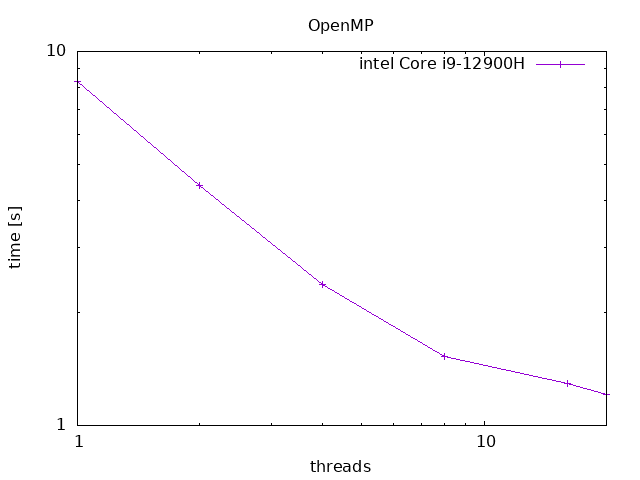

<!--

This document is written in Markdown.
You can preview on such as VisualStudio Code.
If you want to know more, search with "vscode markdown" or refer to official document https://code.visualstudio.com/Docs/languages/markdown .

-->

# 2. OpenMP

## Cコード
### フォルダ構成
- bin：実行ファイル(.out)を置くフォルダ
- build：コンパイル時の作成ファイルを置くフォルダ
	- dep：コンパイル時の依存関係ファイル(.d)を置くフォルダ
	- obj：コンパイル時のオブジェクトファイル(.o)を置くフォルダ
- docs：ドキュメントファイルを置くフォルダ
	- image：ドキュメントファイルに挿入する図を置くフォルダ
- include：ヘッダーファイル(.h)を置くフォルダ
- lib：プロジェクトに使用するライブラリファイル(.a)を置くフォルダ
- parts：プロジェクトに使用するライブラリファイルのソースコードを置くフォルダ
- src：ソースファイル(.c)を置くフォルダ
- test：ライブラリテストコードファイル(.c)を置くフォルダ

LICENCE：  
makefile：  
Plot.sh：  
README.md：  

### スレッド並列処理（OpenMP）
以下の式を計算させる


$$
\begin{align*}
\lim_{n \rightarrow \infty} \sum_{m=0}^n \frac{{(-1)}^m}{2m + 1} = \frac{\pi}{4}\\
\end{align*}
$$


```C
/*standard library*/
#include <omp.h>

#pragma omp parallel for private(j) reduction(+:total) num_threads(core_num)
for (i = 0; i < L; i++)
{
    j = 2 * i + 1;
    j = 1.0 / j;
    if(i % 2 == 1) j *= -1;
    total += j;
}
```

### 時間計測処理
C言語標準ライブラリ<time.h>内関数clock_gettime()を使う。  
この関数の引数の一つ、クロックIDにはCLOCK_REALTIMEを指定しているがどれがいいのかは正直わからない。
```C
/*standard library*/
#include <stdio.h>
#include <stdint.h>
#include <math.h>
#include <omp.h>
#include <time.h>

/*
*	function name:main
*	about:
*		project main function
*
*	in	uint64_t	argc	:command line argument number
*	in	char*		argv[]	:command line argument pointer
*	out	int					:error code
*/
int main(uint64_t argc, char const* argv[])
{
	uint64_t i, L;
	int64_t n;
	double j,total;
	struct timespec startTime, endTime;

	n = omp_get_max_threads(); 

	L = pow(10,10);

	for(uint64_t core_num = 1 ; core_num < n ; core_num *= 2)
	{
		total = 0;

		clock_gettime(CLOCK_REALTIME, &startTime);

		#pragma omp parallel for private(j) reduction(+:total) num_threads(core_num)
		for (i = 0; i < L; i++)
		{
			j = 2 * i + 1;
			j = 1.0 / j;
			if(i % 2 == 1) j *= -1;
			total += j;
		}

		clock_gettime(CLOCK_REALTIME, &endTime);

	}

	return 0;
}
```


## コンパイル

```
make
```

## 実行
./result.pltファイルが出力される。
```
make execute
```
## 結果出力
gnuplot で PNGファイルを出力するShellファイルを実行する。
```
./Plot.sh ./result.plt "intel Core i9-12900H"
```


----
[Back to Home](../README.md)

<!-- Written by Croyfet in 2022-->
