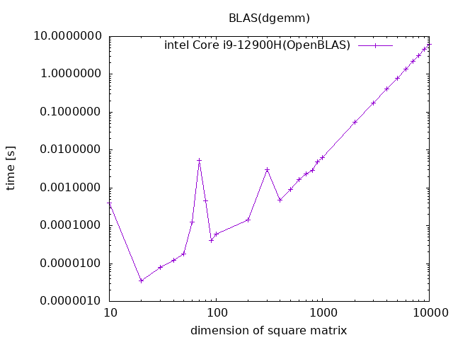

<!--

This document is written in Markdown.
You can preview on such as VisualStudio Code.
If you want to know more, search with "vscode markdown" or refer to official document https://code.visualstudio.com/Docs/languages/markdown .

-->

# 3. BLAS
## インストール
- Reference BLAS
```
sudo apt install libblas-dev
```
- BLIS
```
sudo apt install libblis-dev
```
- OpenBLAS
```
sudo apt install libopenblas-base
sudo apt install libopenblas-dev
```
- Intel Math Kernel Library (MKL)
```
sudo apt install intel-mkl
```
※デフォルト設定はoffする

## ライブラリの切り替え
- libblas.so
```
sudo update-alternatives --config libblas.so-x86_64-linux-gnu
```
すると以下のライブラリ選択画面が表示される。使用したいライブラリの番号を入力してEnter
```
There are 4 choices for the alternative libblas.so-x86_64-linux-gnu (providing /usr/lib/x86_64-linux-gnu/libblas.so).

  Selection    Path                                                   Priority   Status
------------------------------------------------------------
* 0            /usr/lib/x86_64-linux-gnu/openblas-pthread/libblas.so   100       auto mode
  1            /usr/lib/x86_64-linux-gnu/blas/libblas.so               10        manual mode
  2            /usr/lib/x86_64-linux-gnu/blis-openmp/libblas.so        80        manual mode
  3            /usr/lib/x86_64-linux-gnu/libmkl_rt.so                  1         manual mode
  4            /usr/lib/x86_64-linux-gnu/openblas-pthread/libblas.so   100       manual mode

Press <enter> to keep the current choice[*], or type selection number:
```
- libblas.so.3
```
sudo update-alternatives --config libblas.so.3-x86_64-linux-gnu
```
すると以下のライブラリ選択画面が表示される。使用したいライブラリの番号を入力してEnter
```
There are 4 choices for the alternative libblas.so.3-x86_64-linux-gnu (providing /usr/lib/x86_64-linux-gnu/libblas.so.3).

  Selection    Path                                                     Priority   Status
------------------------------------------------------------
* 0            /usr/lib/x86_64-linux-gnu/openblas-pthread/libblas.so.3   100       auto mode
  1            /usr/lib/x86_64-linux-gnu/blas/libblas.so.3               10        manual mode
  2            /usr/lib/x86_64-linux-gnu/blis-openmp/libblas.so.3        80        manual mode
  3            /usr/lib/x86_64-linux-gnu/libmkl_rt.so                    1         manual mode
  4            /usr/lib/x86_64-linux-gnu/openblas-pthread/libblas.so.3   100       manual mode

Press <enter> to keep the current choice[*], or type selection number:
```

## Cコード
### フォルダ構成
- bin：実行ファイル(.out)を置くフォルダ
- build：コンパイル時の作成ファイルを置くフォルダ
	- dep：コンパイル時の依存関係ファイル(.d)を置くフォルダ
	- obj：コンパイル時のオブジェクトファイル(.o)を置くフォルダ
- docs：ドキュメントファイルを置くフォルダ
	- image：ドキュメントファイルに挿入する図を置くフォルダ
- include：ヘッダーファイル(.h)を置くフォルダ
- lib：プロジェクトに使用するライブラリファイル(.a)を置くフォルダ
- parts：プロジェクトに使用するライブラリファイルのソースコードを置くフォルダ
- src：ソースファイル(.c)を置くフォルダ
- test：ライブラリテストコードファイル(.c)を置くフォルダ

LICENCE：  
makefile：  
Plot.sh：  
README.md：  

### 行列積関数：dgemm_()
```C
/*standard library*/
#include <stdint.h>
#include <stdlib.h>

uint32_t m, n, k;
double *a, *b, *c;
double alpha, beta;
uint32_t lda, ldb, ldc;

m = (i + 1) * 10;
n = (i + 1) * 10;
k = (i + 1) * 10;

a = (double *)malloc(sizeof(double) * m * k); // m x k matrix
b = (double *)malloc(sizeof(double) * k * n); // k x n matrix
c = (double *)malloc(sizeof(double) * m * n); // m x n matrix

for (uint64_t i=0; i<m; i++)
{
    for (uint64_t j=0; j<k; j++)
    {
        a[i + m * j] = rand() / (1.0 + RAND_MAX);
    }
}

for (uint64_t i=0; i<k; i++)
{
    for (uint64_t j=0; j<n; j++)
    {
        b[i + k * j] = rand() / (1.0 + RAND_MAX);
    }
}

for (uint64_t i=0; i<m; i++)
{
    for (uint64_t j=0; j<n; j++)
    {
        c[i + m * j] = 0;
    }
}

alpha = 1.;
beta = 0.;
lda = m; 
ldb = k; 
ldc = m; 

dgemm_("N", "N", &m, &n, &k, &alpha, a, &lda, b, &ldb, &beta, c, &ldc);

free(a);
free(b);
free(c);
```

### 時間計測処理
C言語標準ライブラリ<time.h>内関数clock_gettime()を使う。  
この関数の引数の一つ、クロックIDにはCLOCK_REALTIMEを指定しているがどれがいいのかは正直わからない。
```C
/*standard library*/
#include <stdio.h>
#include <stdint.h>
#include <stdlib.h>
#include <time.h>

/*
*	function name:main
*	about:
*		project main function
*
*	in	uint64_t	argc	:command line argument number
*	in	char*		argv[]	:command line argument pointer
*	out	int					:error code
*/
int main(uint64_t argc, char const *argv[])
{
	uint32_t m, n, k;
	double *a, *b, *c;
	double alpha, beta;
	uint32_t lda, ldb, ldc;
	struct timespec startTime, endTime;

	for(int32_t i = 0 ; i < 9; i ++)
	{
		m = (i + 1) * 10;
		n = (i + 1) * 10;
		k = (i + 1) * 10;

		a = (double *)malloc(sizeof(double) * m * k); // m x k matrix
		b = (double *)malloc(sizeof(double) * k * n); // k x n matrix
		c = (double *)malloc(sizeof(double) * m * n); // m x n matrix

		for (uint64_t i=0; i<m; i++)
		{
			for (uint64_t j=0; j<k; j++)
			{
				a[i + m * j] = rand() / (1.0 + RAND_MAX);
			}
		}

		for (uint64_t i=0; i<k; i++)
		{
			for (uint64_t j=0; j<n; j++)
			{
				b[i + k * j] = rand() / (1.0 + RAND_MAX);
			}
		}

		for (uint64_t i=0; i<m; i++)
		{
			for (uint64_t j=0; j<n; j++)
			{
				c[i + m * j] = 0;
			}
		}

		alpha = 1.;
		beta = 0.;
		lda = m; 
		ldb = k; 
		ldc = m; 

		clock_gettime(CLOCK_REALTIME, &startTime);
		dgemm_("N", "N", &m, &n, &k, &alpha, a, &lda, b, &ldb, &beta, c, &ldc);
		clock_gettime(CLOCK_REALTIME, &endTime);

		free(a);
		free(b);
		free(c);
	}

	return 0;
}
```


## コンパイル

```
make
```

## 実行
./result.pltファイルが出力される。
```
make execute
```
## 結果出力
gnuplot で PNGファイルを出力するShellファイルを実行する。
```
./Plot.sh ./result.plt "intel Core i9-12900H(OpenBLAS)"
```


----
[Back to Home](../README.md)

<!-- Written by Croyfet in 2022-->
